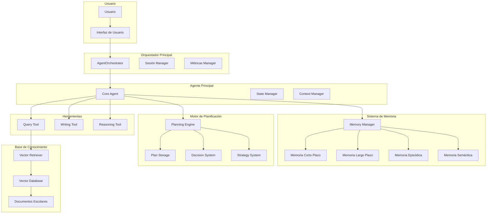

# SchoolBot Agent - Agente Inteligente Escolar 🤖

**Evaluación Parcial N°2 (EP2) - Ingeniería de Soluciones con IA**  
**Autor:** Tania Herrera  
**Institución:** Duoc UC  
**Fecha:** Diciembre 2024

---

## 🎯 **DESCRIPCIÓN GENERAL**

SchoolBot Agent es un **agente funcional de IA** desarrollado para el Colegio San Ignacio Digital, capaz de integrar herramientas de consulta, escritura y razonamiento con capacidades avanzadas de memoria, planificación y toma de decisiones adaptativas.

### **Características Principales**

- 🧠 **Memoria de Corto y Largo Plazo**: Sistema de memoria persistente con recuperación semántica
- 🎯 **Planificación Inteligente**: Motor de planificación jerárquica con adaptación dinámica
- 🛠️ **Herramientas Especializadas**: Consulta, escritura y razonamiento integrados
- 🔄 **Comportamiento Adaptativo**: Aprendizaje continuo y ajuste de estrategias
- 🚀 **Autonomía Funcional**: Ejecución de tareas complejas sin intervención directa

---

## 🏗️ **ARQUITECTURA DEL SISTEMA**

### **Diagrama de Arquitectura**



### **Componentes Principales**

#### **1. Orquestador Principal (AgentOrchestrator)**
- **Función**: Coordina todos los componentes del sistema
- **Responsabilidades**:
  - Gestión de sesiones de usuario
  - Coordinación de herramientas
  - Monitoreo de rendimiento
  - Manejo de errores y recuperación

#### **2. Agente Principal (Core Agent)**
- **Función**: Núcleo del sistema de IA
- **Características**:
  - Estados del agente (IDLE, THINKING, PLANNING, EXECUTING)
  - Análisis de solicitudes
  - Gestión de contexto
  - Métricas de rendimiento

#### **3. Sistema de Memoria (Memory Manager)**
- **Memoria de Corto Plazo**: Conversaciones recientes (buffer circular)
- **Memoria de Largo Plazo**: Información persistente importante
- **Memoria Episódica**: Eventos específicos y feedback
- **Memoria Semántica**: Conocimiento general con embeddings

#### **4. Motor de Planificación (Planning Engine)**
- **Planificación Jerárquica**: División de tareas complejas
- **Toma de Decisiones**: Evaluación de opciones y selección
- **Estrategias Adaptativas**: Aprendizaje de patrones exitosos
- **Optimización**: Mejora continua de planes

#### **5. Herramientas Especializadas**
- **Query Tool**: Búsqueda semántica en documentos escolares
- **Writing Tool**: Generación de documentos y reportes
- **Reasoning Tool**: Análisis y toma de decisiones

---

## ⚙️ **INSTALACIÓN Y CONFIGURACIÓN**

### **Requisitos del Sistema**

- Python 3.8+
- OpenAI API Key
- Memoria RAM: 4GB mínimo
- Espacio en disco: 2GB

### **Instalación**

```bash
# 1. Clonar el repositorio
git clone <repository-url>
cd schoolbot_project

# 2. Instalar dependencias
pip install -r requirements.txt

# 3. Configurar variables de entorno
cp env.example .env
# Editar .env con tu OpenAI API Key

# 4. Inicializar base de datos vectorial
python src/embeddings/generate_embeddings.py

# 5. Ejecutar el agente
python src/agent/demo.py
```

### **Configuración**

El sistema utiliza configuración jerárquica:

```python
from src.agent.config import get_complete_config

# Configuración para estudiante en desarrollo
config = get_complete_config("estudiante", "development")

# Configuración para profesor en producción
config = get_complete_config("profesor", "production")
```

---

## 🚀 **USO DEL SISTEMA**

### **Inicialización Básica**

```python
from src.agent.orchestrator import create_agent_orchestrator
from src.agent.config import get_complete_config

# Crear orquestador
config = get_complete_config("profesor", "development")
orchestrator = create_agent_orchestrator()

# Crear sesión de usuario
session_id = orchestrator.create_session(
    user_id="profesor_001",
    user_type="profesor"
)

# Procesar solicitud
response = orchestrator.process_request(
    session_id=session_id,
    request="¿Cuáles son los horarios de clases?"
)
```

### **Ejemplos de Uso**

#### **1. Consulta Simple**
```python
request = "¿Cuándo son las vacaciones de invierno?"
response = orchestrator.process_request(session_id, request)
print(response["response"])
```

#### **2. Tarea Compleja con Planificación**
```python
request = """
Genera un reporte académico completo para el estudiante Juan Pérez del curso 3°A, 
incluyendo análisis de rendimiento y recomendaciones de mejora
"""
response = orchestrator.process_request(session_id, request)

# El agente creará un plan automáticamente
plan = response["plan"]
print(f"Plan creado con {len(plan['steps'])} pasos")
```

#### **3. Uso de Herramientas Específicas**
```python
# Herramienta de escritura
writing_request = "Genera un comunicado para apoderados sobre la próxima reunión"
response = orchestrator.process_request(session_id, writing_request)

# Herramienta de razonamiento
reasoning_request = "Analiza las opciones para mejorar el rendimiento académico"
response = orchestrator.process_request(session_id, reasoning_request)
```

---

## 🧠 **SISTEMA DE MEMORIA**

### **Tipos de Memoria**

#### **Memoria de Corto Plazo**
- **Propósito**: Almacenar conversaciones recientes
- **Capacidad**: 100 entradas (configurable)
- **Persistencia**: Temporal (se pierde al reiniciar)
- **Uso**: Contexto inmediato de conversación

#### **Memoria de Largo Plazo**
- **Propósito**: Información importante persistente
- **Capacidad**: 1000 entradas (configurable)
- **Persistencia**: Permanente en disco
- **Uso**: Conocimiento acumulado del sistema

#### **Memoria Episódica**
- **Propósito**: Eventos específicos y feedback
- **Capacidad**: Ilimitada
- **Persistencia**: Permanente
- **Uso**: Aprendizaje de patrones de éxito/fallo

#### **Memoria Semántica**
- **Propósito**: Conocimiento general con embeddings
- **Capacidad**: Ilimitada
- **Persistencia**: Vector store persistente
- **Uso**: Búsqueda semántica y recuperación de contexto

### **Gestión de Memoria**

```python
# Recuperar memoria relevante
memory_results = memory_manager.retrieve_memory(
    query="horarios de clases",
    memory_type="semantic",
    limit=5
)

# Almacenar interacción
memory_manager.store_interaction({
    "request": "¿Cuáles son los horarios?",
    "response": "Las clases son de 8:00 a 16:00",
    "analysis": {"complexity": "simple"},
    "context": {"user_type": "estudiante"}
})
```

---

## 🎯 **MOTOR DE PLANIFICACIÓN**

### **Características**

- **Planificación Jerárquica**: Divide tareas complejas en pasos manejables
- **Toma de Decisiones**: Evalúa opciones basándose en contexto y restricciones
- **Estrategias Adaptativas**: Aprende de patrones exitosos
- **Optimización**: Mejora planes basándose en feedback

### **Tipos de Planificación**

#### **1. Planificación Secuencial**
- Para tareas simples con herramientas únicas
- Ejemplo: Búsqueda de información

#### **2. Planificación Jerárquica**
- Para tareas complejas con múltiples herramientas
- Ejemplo: Generación de reporte completo

#### **3. Planificación Adaptativa**
- Ajusta estrategias basándose en contexto
- Ejemplo: Diferentes enfoques según tipo de usuario

### **Ejemplo de Plan Generado**

```json
{
  "id": "plan_1234567890",
  "name": "Plan para: Generar reporte académico",
  "steps": [
    {
      "id": "step_1",
      "description": "Buscar información del estudiante",
      "tool": "query",
      "action": "search",
      "parameters": {"query": "Juan Pérez 3°A rendimiento"},
      "estimated_duration": 10
    },
    {
      "id": "step_2", 
      "description": "Analizar datos encontrados",
      "tool": "reasoning",
      "action": "analyze",
      "parameters": {"analysis_type": "academic_performance"},
      "estimated_duration": 15
    },
    {
      "id": "step_3",
      "description": "Generar reporte final",
      "tool": "writing",
      "action": "generate",
      "parameters": {"document_type": "reporte_academico"},
      "estimated_duration": 20
    }
  ]
}
```

---

## 🛠️ **HERRAMIENTAS ESPECIALIZADAS**

### **1. Query Tool - Herramienta de Consulta**

**Propósito**: Buscar información en documentos escolares

**Capacidades**:
- Búsqueda semántica con embeddings
- Filtrado por tipo de usuario
- Recuperación de contexto relevante
- Sugerencias de búsqueda

**Ejemplo de uso**:
```python
query_result = query_tool.execute("search", {
    "query": "horarios de clases",
    "user_type": "estudiante",
    "top_k": 5
})
```

### **2. Writing Tool - Herramienta de Escritura**

**Propósito**: Generar documentos escolares

**Capacidades**:
- Plantillas predefinidas (reportes, comunicados, actas)
- Formateo automático
- Resumen de texto
- Traducción

**Plantillas disponibles**:
- `reporte_academico`: Reportes de rendimiento estudiantil
- `comunicado_apoderados`: Comunicados oficiales
- `acta_reunion`: Actas de reuniones

**Ejemplo de uso**:
```python
document = writing_tool.execute("generate", {
    "document_type": "comunicado_apoderados",
    "content": {
        "contenido": "Reunión de apoderados el 15 de diciembre",
        "fecha": "15/12/2024",
        "horario": "19:00 horas",
        "lugar": "Auditorio principal"
    }
})
```

### **3. Reasoning Tool - Herramienta de Razonamiento**

**Propósito**: Análisis y toma de decisiones

**Capacidades**:
- Análisis de información
- Evaluación de opciones
- Toma de decisiones estructurada
- Síntesis de resultados

**Ejemplo de uso**:
```python
analysis = reasoning_tool.execute("analyze", {
    "information": "Datos de rendimiento académico",
    "analysis_type": "academic_performance"
})

decision = reasoning_tool.execute("decide", {
    "situation": "Mejorar rendimiento académico",
    "options": ["Tutorías", "Grupos de estudio", "Tecnología"],
    "constraints": ["Presupuesto limitado", "Tiempo disponible"]
})
```

---

## 📊 **MONITOREO Y MÉTRICAS**

### **Métricas del Sistema**

- **Sesiones**: Total y activas
- **Solicitudes**: Total, exitosas, fallidas
- **Tiempo de respuesta**: Promedio y distribución
- **Uso de memoria**: Hit rate y capacidad
- **Rendimiento de planes**: Tasa de éxito

### **Monitoreo en Tiempo Real**

```python
# Obtener estado del sistema
status = orchestrator.get_agent_status()

print(f"Sesiones activas: {status['system_metrics']['active_sessions']}")
print(f"Solicitudes exitosas: {status['system_metrics']['successful_requests']}")
print(f"Tiempo promedio: {status['system_metrics']['average_response_time']:.2f}s")
```

### **Logs y Debugging**

El sistema genera logs estructurados:

```
2024-12-15 10:30:15 INFO - Agente SchoolBot inicializado correctamente
2024-12-15 10:30:20 INFO - Sesión creada: session_123 para usuario profesor_001
2024-12-15 10:30:25 INFO - Plan creado: plan_456 con 3 pasos
2024-12-15 10:30:30 INFO - Solicitud procesada en 2.45s para sesión session_123
```

---

## 🧪 **PRUEBAS Y VALIDACIÓN**

### **Ejecutar Demostración Completa**

```bash
python src/agent/demo.py
```

### **Pruebas Específicas**

```python
from src.agent.demo import SchoolBotAgentDemo

demo = SchoolBotAgentDemo()
demo.initialize("profesor", "development")

# Crear sesión
session_id = demo.create_demo_session("test_user", "profesor")

# Ejecutar pruebas
demo.demo_simple_query(session_id)
demo.demo_complex_task(session_id)
demo.demo_memory_usage(session_id)
demo.demo_writing_tool(session_id)
demo.demo_reasoning_tool(session_id)
```

### **Casos de Prueba**

1. **Consulta Simple**: Verificar respuesta rápida y precisa
2. **Tarea Compleja**: Validar planificación automática
3. **Memoria**: Confirmar persistencia y recuperación
4. **Herramientas**: Probar cada herramienta individualmente
5. **Adaptación**: Verificar comportamiento adaptativo

---

## 🔧 **CONFIGURACIÓN AVANZADA**

### **Configuración por Tipo de Usuario**

```python
# Estudiante: Configuración básica
student_config = get_user_config("estudiante")
# - Máximo 5 resultados de búsqueda
# - Plantillas deshabilitadas
# - Análisis básico

# Profesor: Configuración completa
teacher_config = get_user_config("profesor")
# - Máximo 10 resultados de búsqueda
# - Plantillas habilitadas
# - Análisis detallado

# Admin: Configuración máxima
admin_config = get_user_config("admin")
# - Máximo 15 resultados de búsqueda
# - Todas las funcionalidades
# - Análisis comprensivo
```

### **Configuración por Entorno**

```python
# Desarrollo: Logging detallado, sin rate limiting
dev_config = get_environment_config("development")

# Testing: Configuración mínima para pruebas
test_config = get_environment_config("testing")

# Producción: Logging mínimo, rate limiting activo
prod_config = get_environment_config("production")
```

---

## 🚀 **DESPLIEGUE EN PRODUCCIÓN**

### **Requisitos de Producción**

- **Servidor**: Ubuntu 20.04+ o equivalente
- **Memoria RAM**: 8GB mínimo
- **CPU**: 4 cores mínimo
- **Almacenamiento**: 10GB SSD
- **Red**: Conexión estable a internet

### **Variables de Entorno**

```bash
# .env para producción
OPENAI_API_KEY=your_openai_api_key
ENVIRONMENT=production
LOG_LEVEL=WARNING
MEMORY_PATH=/var/lib/schoolbot/memory
VECTOR_DB_PATH=/var/lib/schoolbot/vector_db
MAX_SESSIONS=1000
RATE_LIMIT_PER_MINUTE=30
```

### **Docker Deployment**

```dockerfile
FROM python:3.9-slim

WORKDIR /app
COPY requirements.txt .
RUN pip install -r requirements.txt

COPY src/ ./src/
COPY data/ ./data/

EXPOSE 8000
CMD ["python", "src/agent/demo.py"]
```

---

## 📈 **ROADMAP Y MEJORAS FUTURAS**

### **Versión 2.1 (Q1 2025)**
- [ ] Integración con sistemas escolares externos
- [ ] Soporte para múltiples idiomas
- [ ] Dashboard de administración web

### **Versión 2.2 (Q2 2025)**
- [ ] Análisis predictivo de rendimiento
- [ ] Recomendaciones personalizadas
- [ ] Integración con calendarios escolares

### **Versión 3.0 (Q3 2025)**
- [ ] Agentes especializados por área
- [ ] Procesamiento de voz
- [ ] Análisis de sentimientos

---

## 🤝 **CONTRIBUCIÓN**

### **Estructura del Proyecto**

```
src/agent/
├── __init__.py          # Módulo principal
├── core_agent.py        # Agente principal
├── memory_manager.py    # Gestor de memoria
├── planning_engine.py   # Motor de planificación
├── tools.py            # Herramientas especializadas
├── orchestrator.py     # Orquestador principal
├── config.py           # Configuración
└── demo.py             # Demostración
```

### **Estándares de Código**

- **PEP 8**: Formateo de código Python
- **Type Hints**: Anotaciones de tipos obligatorias
- **Docstrings**: Documentación de funciones y clases
- **Logging**: Logs estructurados para debugging

---

## 📄 **LICENCIA**

Este proyecto es desarrollado como parte de la evaluación académica EP2 de la asignatura ISY0101 - Ingeniería de Soluciones con IA de Duoc UC.

---

## 👩‍💻 **AUTORA**

**Tania Herrera Rodriguez**  
Estudiante de Ingeniería en Informática  
Duoc UC - 2025

---

## 📚 **REFERENCIAS**

1. **LangChain Documentation** - https://python.langchain.com/
2. **OpenAI API Documentation** - https://platform.openai.com/docs
3. **Chroma Vector Database** - https://docs.trychroma.com/
4. **FastAPI Documentation** - https://fastapi.tiangolo.com/
5. **Sentence Transformers** - https://www.sbert.net/

---

*Este documento forma parte de la Evaluación Parcial N°2 (EP2) de la asignatura ISY0101 - Ingeniería de Soluciones con IA, desarrollado por Tania Herrera para Duoc UC.*
